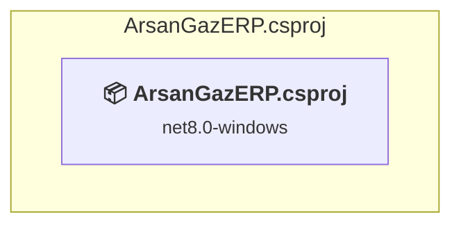

# ArsanGazERP.csproj

[← Back to the assessment index](../../assessment.md)

## Project Info

- **Current Target Framework:** net8.0-windows
- **Proposed Target Framework:** net10.0-windows
- **SDK-style**: True
- **Project Kind:** Wpf
- **Dependencies**: 0
- **Dependants**: 0
- **Number of Files**: 29
- **Number of Files with Incidents**: 11
- **Lines of Code**: 2101
- **Estimated LOC to modify**: 334+ (at least 15,9% of the project)

## Dependency Graph

Legend:
📦 SDK-style project
⚙️ Classic project

## API Compatibility

| Category | Count | Impact |
| :--- | :---: | :--- |
| 🔴 Binary Incompatible | 317 | High - Require code changes |
| 🟡 Source Incompatible | 0 | Medium - Needs re-compilation and potential conflicting API error fixing |
| 🔵 Behavioral change | 17 | Low - Behavioral changes that may require testing at runtime |
| ✅ Compatible | 4538 |  |
| ***Total APIs Analyzed*** | ***4872*** |  |

## NuGet Package Issues

| Package | Current Version | Suggested Version | Severity | Issue |
| :--- | :---: | :---: | :---: | :--- |
| Microsoft.EntityFrameworkCore.Design | 8.0.21 | 10.0.12 | 🟡 Potential | NuGet paketinin yükseltilmesi önerilir |
| Microsoft.EntityFrameworkCore.Sqlite | 8.0.21 | 10.0.12 | 🟡 Potential | NuGet paketinin yükseltilmesi önerilir |
| Microsoft.EntityFrameworkCore.Tools | 8.0.21 | 10.0.12 | 🟡 Potential | NuGet paketinin yükseltilmesi önerilir |

Every project affected by these packages, and the versions the repository settles on: [aggregate NuGet packages](../nuget/aggregate-packages.md).

## Project Technologies and Features

| Technology | Issues | Percentage | Migration Path |
| :--- | :---: | :---: | :--- |
| WPF (Windows Presentation Foundation) | 159 | 47,6% | WPF APIs for building Windows desktop applications with XAML-based UI that are available in .NET on Windows. WPF provides rich desktop UI capabilities with data binding and styling. Enable Windows Desktop support: Option 1 (Recommended): Target net9.0-windows; Option 2: Add <UseWindowsDesktop>true</UseWindowsDesktop>. |

